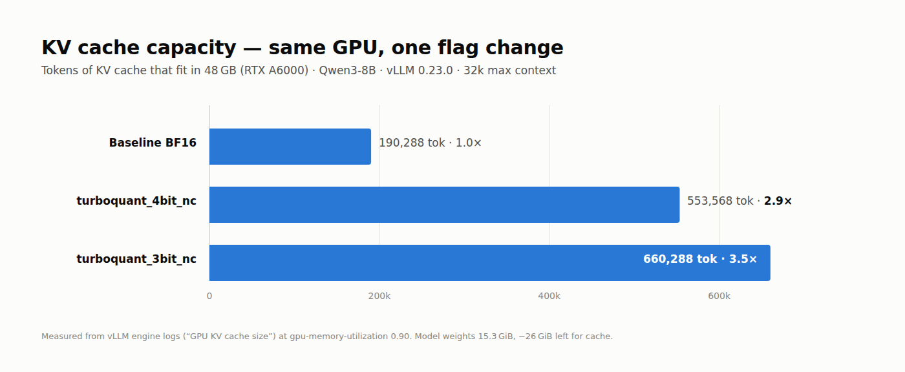
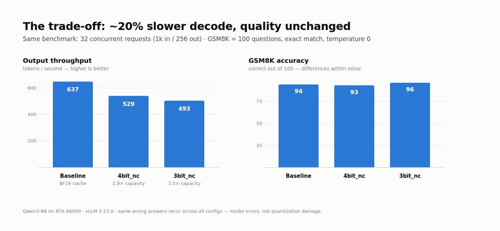
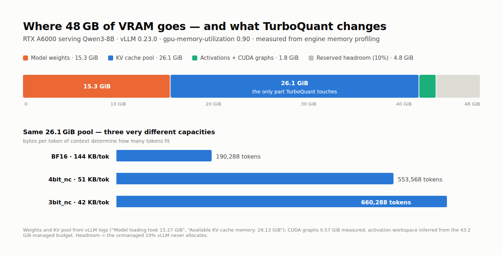

# TurboQuant KV cache quantization — measured on real hardware

Independent benchmark of vLLM's TurboQuant KV cache compression: capacity, throughput,
and quality, measured on a single RTX A6000. One flag change, no other differences.





## Setup

| | |
|---|---|
| Model | [Qwen/Qwen3-8B](https://huggingface.co/Qwen/Qwen3-8B) (BF16 weights, 36 layers, GQA 32Q/8KV) |
| GPU | NVIDIA RTX A6000 48 GB (Ampere, sm86) |
| Serving | vLLM v0.23.0 (`vllm/vllm-openai` Docker image) |
| Config | `--max-model-len 32768 --gpu-memory-utilization 0.90` |
| Only variable | `--kv-cache-dtype` (absent = BF16 baseline) |

## VRAM budget



With `--gpu-memory-utilization 0.90`, vLLM manages 43.2 GiB of the A6000's 48 GiB and
never touches the remaining 10%. The managed budget breaks down as follows (from the
engine's memory profiling at startup):

| Component | Size | Notes |
|---|---|---|
| Model weights | 15.27 GiB | Qwen3-8B in BF16, measured at load |
| KV cache pool | 26.13 GiB | everything left after weights + workspace |
| CUDA graphs | 0.57 GiB | captured at startup for decode latency |
| Activation workspace | ~1.2 GiB | forward-pass scratch, sized by profiling |
| Reserved headroom | 4.80 GiB | the unmanaged 10% |

The key observation: **TurboQuant does not change this allocation at all.** The KV pool
stays 26.13 GiB in every configuration. What changes is the cost per cached token —
144 KB in BF16 versus 51 KB (`4bit_nc`) and 42 KB (`3bit_nc`) — which is why the same
pool holds 3.5× the tokens. On a memory-bound serving workload, that translates directly
into longer contexts or more concurrent sequences per GPU.

## Results

| Config | KV cache capacity | vs baseline | Max concurrency @32k | Output tok/s | Mean TPOT | GSM8K (100 q) |
|---|---|---|---|---|---|---|
| Baseline (BF16 cache) | 190,288 tok | 1.0× | 5.8× | 637 | 39.4 ms | 94 |
| `turboquant_4bit_nc` | 553,568 tok | **2.9×** | 16.9× | 529 | 49.4 ms | 93 |
| `turboquant_3bit_nc` | 660,288 tok | **3.5×** | 20.2× | 493 | 53.8 ms | 96 |

Throughput: `vllm bench serve`, 32 concurrent requests, 1024 tokens in / 256 out.
Capacity: vLLM engine log line `GPU KV cache size` at identical memory settings.
Quality: 100 GSM8K test questions, exact-match on `#### <number>`, temperature 0.

## Findings

1. **The memory claim holds.** 2.9×–3.5× more KV cache tokens on the same GPU —
   close to the advertised 3.8×/4.9× (the gap is block-padding overhead). In practice:
   ~3× more concurrent conversations, or ~3× longer contexts, without touching hardware.

2. **The trade-off nobody mentions: decode is 17–23% slower.** 637 → 529/493 tok/s.
   Every attention step pays a dequantization cost. Whether that trade is worth 3× capacity
   depends on whether you're memory-bound (usually yes at long context) or compute-bound.

3. **Quality is unchanged on GSM8K.** 94 / 93 / 96 out of 100 — differences are within
   noise at this sample size (3bit beating baseline is luck, not magic). Stronger evidence:
   the *same* questions fail across all three configs — those are the model's own reasoning
   errors, not quantization damage. Raw per-question results are in [`data/`](data/).

## Reproduce

```bash
# baseline
docker run -d --name tq-test --gpus '"device=0"' -v /data/models:/models -p 8001:8000 \
  --ipc=host vllm/vllm-openai:v0.23.0 /models/Qwen/Qwen3-8B \
  --served-model-name qwen3-8b --max-model-len 32768 --gpu-memory-utilization 0.90

# turboquant: append one flag
#   --kv-cache-dtype turboquant_4bit_nc     (or turboquant_3bit_nc)

# throughput
docker exec tq-test vllm bench serve --base-url http://localhost:8000 \
  --model /models/Qwen/Qwen3-8B --served-model-name qwen3-8b \
  --dataset-name random --num-prompts 32 --random-input-len 1024 --random-output-len 256

# quality
python3 eval_gsm8k.py <tag>   # 100 GSM8K questions against localhost:8001
```

## Files

- [`eval_gsm8k.py`](eval_gsm8k.py) — exact-match GSM8K eval against a local OpenAI-compatible endpoint
- [`data/gsm8k_100.json`](data/gsm8k_100.json) — the 100 questions + gold answers used
- [`data/gsm8k_{baseline,tq4bit,tq3bit}.json`](data/) — per-config scores incl. every wrong answer
- [`data/*_quality.txt`](data/) — side-by-side sample generations per config

## References

- [TurboQuant: vLLM blog study](https://vllm.ai/blog/2026-05-11-turboquant)
- [vLLM TurboQuant docs (v0.23.0)](https://docs.vllm.ai/en/v0.23.0/api/vllm/model_executor/layers/quantization/turboquant/)
